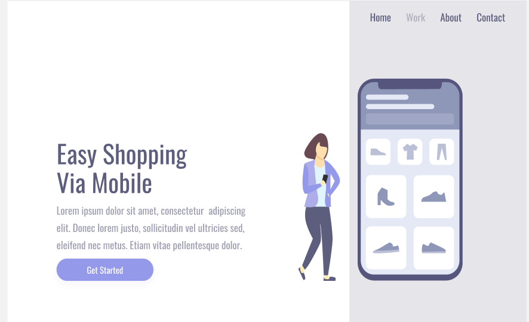
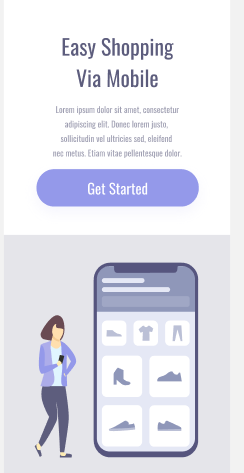

# Desafio-Figma3

<h1>🌐 Projeto Responsivo - Layout Adaptável com HTML e CSS </h1>
Este é o meu terceiro projeto de website, criado com foco em responsividade e design adaptável. O objetivo principal foi desenvolver uma interface que se ajuste perfeitamente a diferentes tamanhos de tela, garantindo uma experiência fluida tanto em desktops quanto em dispositivos móveis.

<h2> 📋 Funcionalidades </h2>
<h3> Layout Responsivo: </h3> A página utiliza media queries para ajustar o conteúdo conforme a largura da tela, oferecendo uma navegação otimizada para todos os dispositivos.
<h3> Divisão de Conteúdo: </h3> O layout é dividido em duas seções principais:
<h3> Esquerda: </h3> Uma área de texto com título e parágrafos explicativos.
<h3> Direita: </h3> Um visual com imagem que complementa o conteúdo, ambos adaptando-se conforme o tamanho da janela.
<h3> Interatividade: </h3> Botões e links possuem efeitos de hover e clique, proporcionando uma experiência de usuário mais agradável e dinâmica.

<h2> 📱 Responsividade </h2>
A responsividade é o destaque deste projeto. Aqui estão as principais adaptações feitas:

<h3> Telas grandes (desktops): </h3> O layout apresenta duas colunas — a área de texto à esquerda e a visual à direita. O design prioriza o equilíbrio entre conteúdo e imagem, com espaçamento adequado e uma experiência visual clara.

Telas menores (smartphones e tablets): Quando o dispositivo tem uma largura menor que 900px, o layout se reorganiza:

O conteúdo de texto e a imagem são dispostos verticalmente.
O tamanho do texto e dos elementos visuais é reduzido para garantir boa legibilidade e usabilidade.
O background e os botões são ajustados para uma melhor interação em telas sensíveis ao toque.

<h2> ⚙️ Tecnologias Utilizadas </h2>
HTML5 para estruturação do conteúdo.
CSS3 para o design responsivo e estilos visuais.
Media Queries para as adaptações conforme a largura da tela.

<h2> 🖼️ Design e Estilos </h2>
<h3> Fontes: </h3> Utilizei a fonte Oswald para garantir um visual moderno e clean.
<h3> Estilos Interativos: </h3> Os botões e links possuem efeitos visuais (hover e clique) para melhorar a experiência do usuário.
<h3> Background Transparente: </h3> A área à direita possui um fundo semi-transparente, garantindo contraste sem perder a elegância.

Minhas redes sociais:

